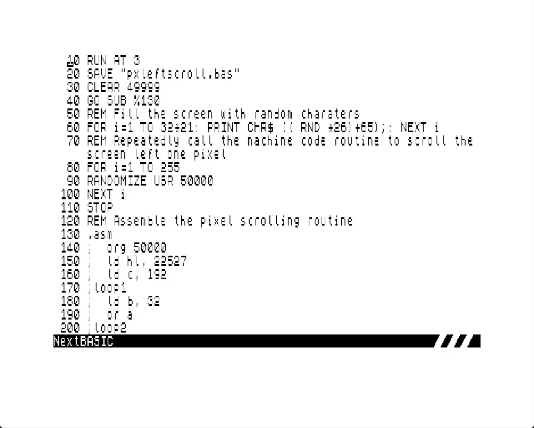

# Getting Started with the NextBASIC Inline Assembler
1. Download the [Assembler](https://taylorza.itch.io/nextbasic-inline-assembler)
2. Extract the `asm` file and put it on the /dot/ folder on your ZX Spectrum Next SD Card
3. Start Writing some assembly code in NextBASIC

## Goal of the project
Many people are interested in learning assembly language on the Next, but they face challenges with the tools. This project aims to make assembly language as easy to learn as BASIC, by providing an environment that lets you code and test without leaving the BASIC interface. This also enables more advanced developers to seamlessly enhance their BASIC programs with assembly language whenever they need to.

My first attempt at improving the initial developer experience was to create a command line tool, [zxenv](https://github.com/taylorza/zxenv) that will download and install a complete development environment and scaffold different project types, such as NextZXOS Drivers, DOT Commands and NEX projects. I use it for all of my projects and it works great. However, this still requires the user to work outside the Next environment and to use emulators or build custom serial cables for debugging on real hardware.

The NextBASIC Inline Assembler lets programmers discover and enjoy the benefits of Z80 Assembly language on the ZX Spectrum Next. It is easy to use, but also has advanced features that enable building larger Assembly projects, custom NextZXOS extensions, and device drivers.

## Examples to get you started
As a very simple example, we will use the ROM to print a string on the screen. Yes, `PRINT` already does this, but we have to start somewhere :)

```
  10 SAVE "asmprint.bas" : REM Just incase things go wrong
  20 CLEAR $bfff : REM Move RAMTOP so we have some space for our code
  30 .asm : REM Assemble our code
  40 ;  ld a, 2
  50 ;  call $1601
  60 ;loop
  70 ;  ld de, msg
  80 ;  ld bc, eom-msg
  90 ;  call $203c
 100 ;  jr loop
 110 ;msg db "Hello World",13
 120 ;eom equ $
 130 RANDOMIZE USR ($c000) : Call our machine code routine
 ```

 The assembler will default to assembling code to address $c000. If you want to target a different address, you can use the `ORG` pseudo-op to define an alternate target address. Here is our same example, that now assembles to address 50000 ($C350). I will use decimal numbers in this example just to show the alternative, but there is no special reason for this.

 ```
  10 SAVE "asmprint2.bas" : REM Just incase things go wrong
  20 CLEAR 49999 : REM Move RAMTOP so we have some space for our code
  30 .asm : REM Assemble our code
  40 ;  org 50000
  50 ;  ld a, 2
  60 ;  call 5633
  70 ;loop
  80 ;  ld de, msg
  90 ;  ld bc, eom-msg
 100 ;  call 8252
 110 ;  jr loop
 120 ;msg db "Hello World Again",13
 130 ;eom equ $
 140 RANDOMIZE USR 50000 : Call our machine code routine
 ```

 OK, enough of this stuff that just seems like a lot of code that does not seem to add any value. I mean really, all that could have been done with a simple

 `10 PRINT "Hello World" : GO TO 10`

 Our next example is from the book [40 Best Machine Code Routines for the ZX Spectrum](https://www.kickstarter.com/projects/robhwson/20-best-machine-code-routines-for-the-zx-spectrum-reprint/description). The routine scrolls the screen left 1 pixel every time you call the routine.



 ```
  10 RUN AT 3
  20 SAVE "pxleftscroll.bas"
  30 CLEAR 49999
  40 GO SUB %130
  50 REM Fill the screen with random characters
  60 FOR i=1 TO 32*21: PRINT CHR$ (( RND *26)+65);: NEXT i
  70 REM Repeatedly call the machine code routine to scroll the screen left one pixel
  80 FOR i=1 TO 255
  90 RANDOMIZE USR 50000
 100 NEXT i
 110 STOP 
 120 REM Assemble the pixel scrolling routine
 130 .asm
 140 ;  org 50000
 150 ;  ld hl, 22527
 160 ;  ld c, 192
 170 ;loop1
 180 ;  ld b, 32
 190 ;  or a
 200 ;loop2
 210 ;  rl (hl)
 220 ;  dec l
 230 ;  djnz loop2
 240 ;  inc l
 250 ;  dec hl
 260 ;  dec c
 270 ;  jp nz, loop1
 280 ;  ret
 290 RETURN 
```


