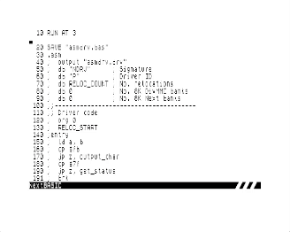

# Simple printer driver
For this example we will create a simple printer driver. The driver will not do much other than flash the border for every character that is sent to the printer using the standard BASIC commands like `LLIST` and `LPRINT` etc. More complex drivers can be created like the [WIFI Printer Driver](https://github.com/taylorza/zxn-wifiprn)[^1].

See [NextZXOS_and_esxDOS_APIs.pdf](https://gitlab.com/thesmog358/tbblue/-/blob/master/docs/nextzxos/NextZXOS_and_esxDOS_APIs.pdf?ref_type=heads) to learn more about writing NextZXOS drivers. The example drivers use a more complex relocation tracking mechanism which is simplified by the [relocation](../Documentation/Pseudo-ops.md#reloc_start) model provided in this assembler.

**NOTE** Because the example below is so small it could easily have been written without the need for relocations at all. `JP` were used specifically to demonstrate the relocation support in the assembler.

```
  10 RUN AT 3
  20 SAVE "asmdrv.bas"
  30 .asm
  40 ;  output "asmdrv.drv"
  50 ;  db "NDRV"      ; Signature
  60 ;  db "P"         ; Driver ID
  70 ;  db RELOC_COUNT ; No. relocations
  80 ;  db 0           ; No. 8K DivMMC banks
  90 ;  db 0           ; No. 8K Next banks
 100 ;;---------------------------------------
 110 ;; Driver code
 120 ;  org 0
 130 ;  RELOC_START    ; Start relocation tracking 
 140 ;entry
 150 ;  ld a, b
 160 ;  cp $fb    
 170 ;  jp z, output_char
 180 ;  cp $7f
 190 ;  jp z, get_status
 200 ;error
 220 ;  xor a          ; A=0 unsupported call id
 230 ;  scf            ; CY=1 indicate error
 240 ;  ret
 300 ;;---------------------------------------
 310 ;; Call ID  $fb - output char
 320 ;;   E - character to print
 330 ;output_char
 340 ;  ld a, e        ; Get char to print
 350 ;  and 7          ; Mask for border color
 360 ;  out ($fe), a   ; Set border color based on the character being "printed"
 370 ;  or a           ; CY=0 to indicate no error
 380 ;  ret
 400 ;;---------------------------------------
 410 ;; Call ID  $7f - get device status
 420 ;get_status 
 430 ;  ld bc, $ffff   ; Device ready
 440 ;  or a           ; CY=0 to indicate no error
 450 ;  ret
 500 ;  RELOC_END      ; Stop relocation tracking
 510 ;  ASSERT $ < 513 ; Error if driver too big
 520 ;  ds 512-$       ; Pad to end of driver
 530 ;;
 540 ;  RELOC_TABLE    ; Emit relocation table for the driver
```

Once assembled, you can install the driver using the following command
```
.install asmdrv.drv
```

And now, list your program to the "printer" using LLIST to see the driver in action.



[^1]: WIFI Printer driver was not developed with this assembler, but could easily be ported to it
